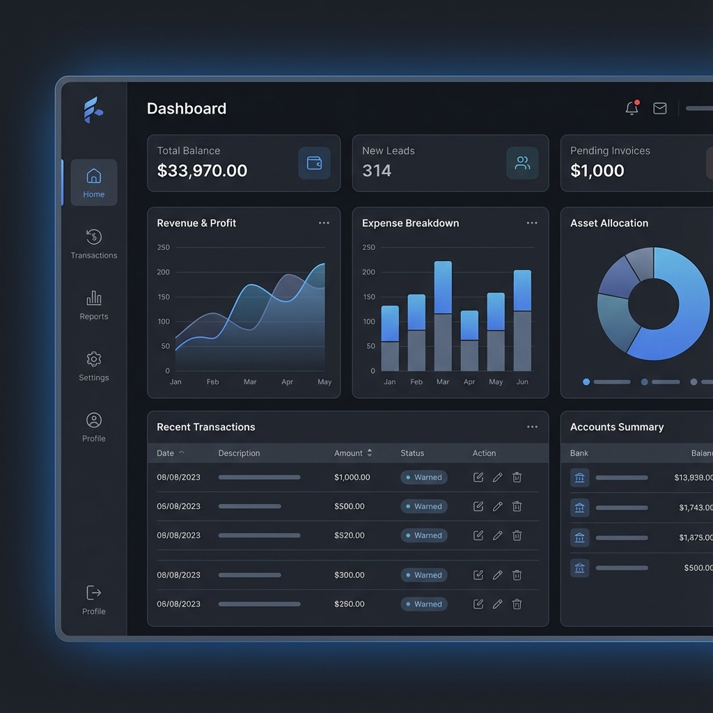

# Md. Shakibul Alam - Software Engineer Portfolio

A premium, high-performance portfolio website built with **React** and **Vite**, designed to showcase software engineering expertise, particularly in Java, Spring Boot, and Microservices architectures.



## 🚀 Features

-   **Modern UI/UX**: Dark mode aesthetic with glassmorphism, smooth gradients, and engaging hover effects.
-   **Responsive Design**: Fully responsive layout optimized for mobile, tablet, and desktop screens.
-   **Routing & Navigation**: Client-side routing with `react-router-dom` for a seamless single-page application experience.
-   **Project Showcase**: Dedicated project details pages with video embed support, feature lists, and technical deep dives.
-   **High-Performance**: Powered by Vite for lightning-fast development and build speeds.
-   **SEO Friendly**: Semantic HTML structure and distinct metadata.

## 🛠️ Tech Stack

-   **Frontend Library**: React (v18+)
-   **Build Tool**: Vite
-   **Styling**: Vanilla CSS (w/ Custom Properties & Utility Classes)
-   **Routing**: React Router DOM (v6)
-   **Linting**: ESLint

## 📂 Installation & Setup

1.  **Clone the repository**
    ```bash
    git clone https://github.com/shakib04/portfolio.git
    cd portfolio-app
    ```

2.  **Install Dependencies**
    ```bash
    npm install
    ```

3.  **Run Development Server**
    ```bash
    npm run dev
    ```
    The app will be available at `http://localhost:5173`.

4.  **Build for Production**
    ```bash
    npm run build
    ```
    This generates static files in the `dist` directory, ready for deployment.

## 🎨 Customization

### Updating Content
-   **Projects**: Edit `src/data/projects.js` to add, remove, or modify project details, images, and video links.
-   **Resume**: Replace `public/resume.pdf` with your updated resume.
-   **Profile Image**: Replace `public/profile.png` with your new headshot.

### Styling
-   **Theme Variables**: Modify `src/index.css` to change global colors (`--accent`, `--bg-color`, etc.) and fonts.

## 📄 License
This project is open source and available under the [MIT License](LICENSE).
